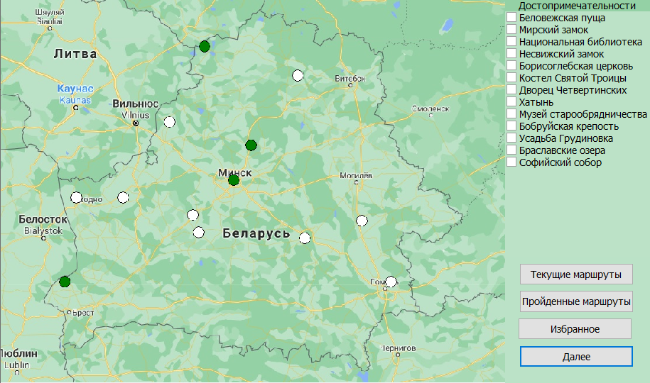

# electronic-guide
# BelaRoute
### This project is a coursework of the second semester of my university studies. The application allows users to create itineraries of Belarusian landmarks. 
### The project functionality includes:
+ ### provision of information about: 
  + ##### completed itineraries,
  + ##### favourite itineraries,
  + ##### current itineraries.
+ ### route optimization,
+ ### route evaluation,
###
### Application graphical user interface:

